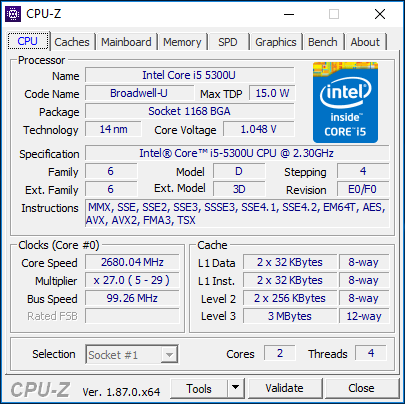
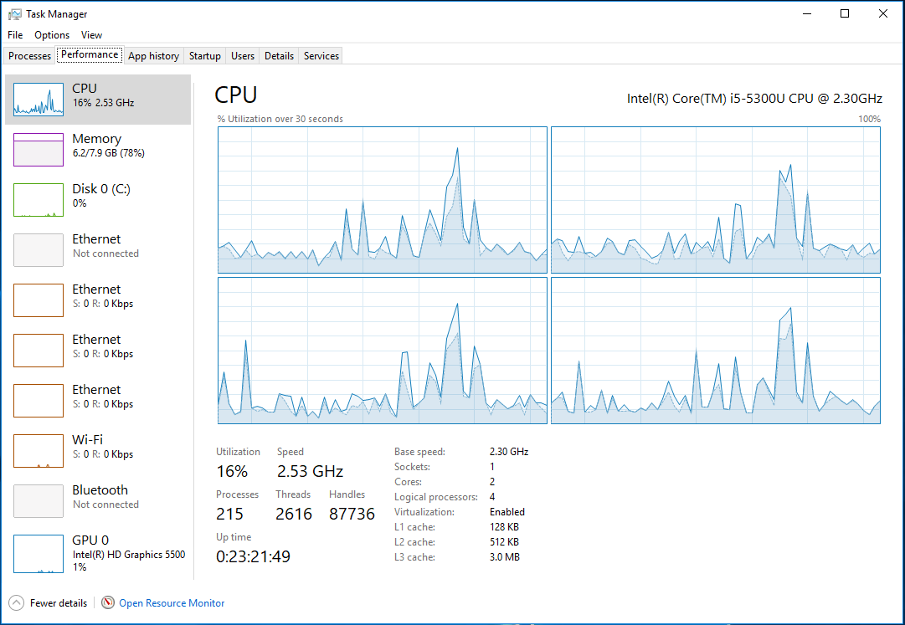
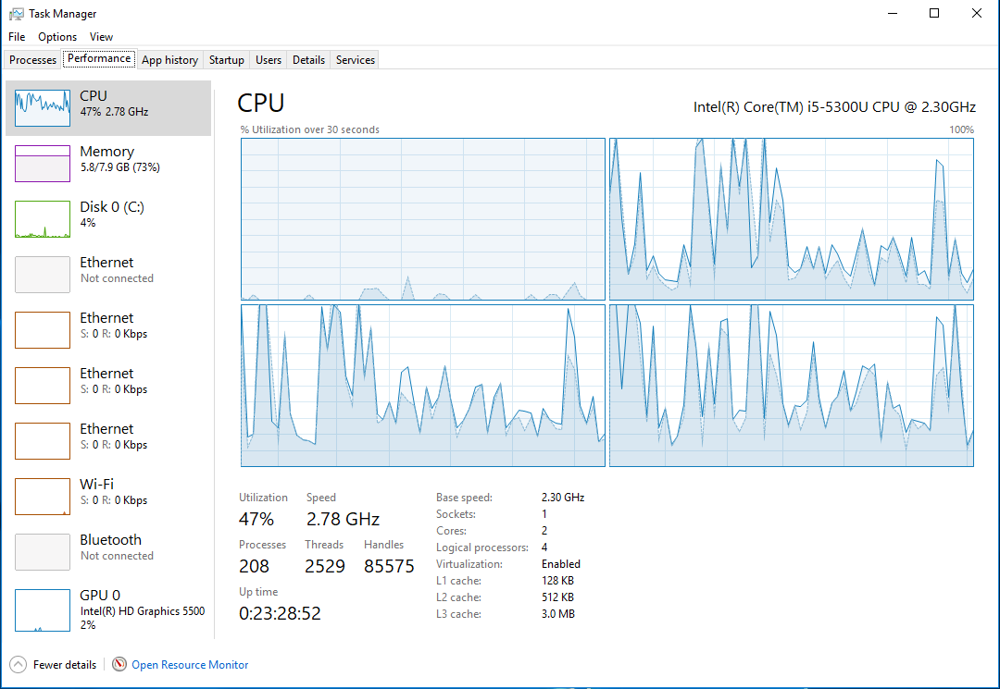
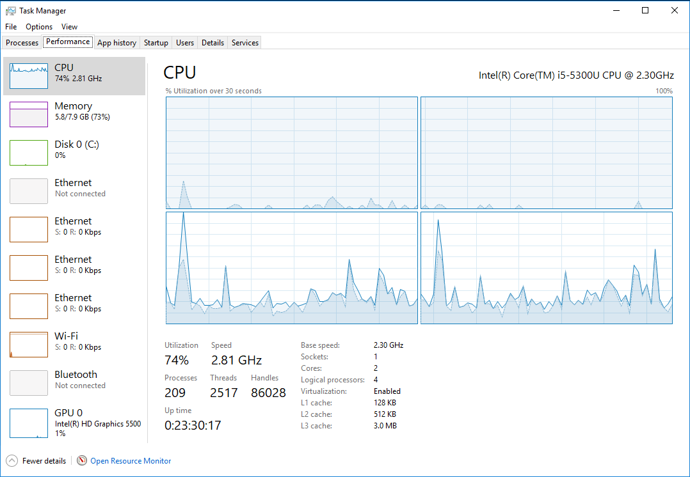
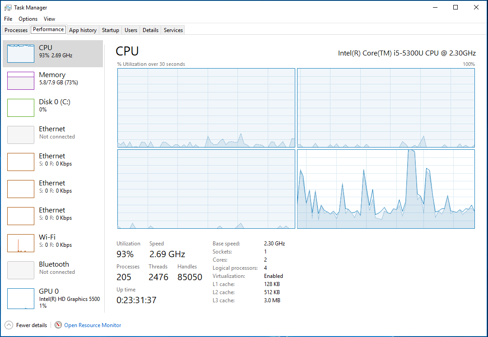
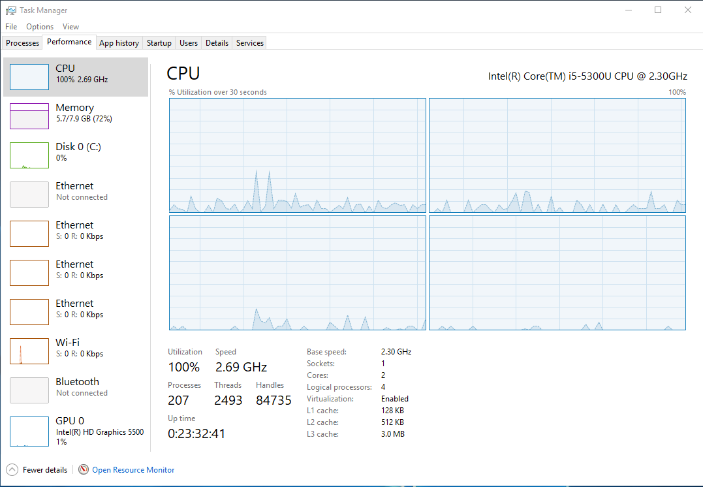

# ParallelFor

[Task Parallel Library (TPL)](https://docs.microsoft.com/en-us/dotnet/standard/parallel-programming/task-parallel-library-tpl)
[Intel Core i5-5300U Processor](https://ark.intel.com/products/85213)

### The Benchmark

Dual Core CPU with 2 Threads per Core.

### Test #1

No TPL ParallelFor execution, system idling.

### Test #2

Parallel.For MaxDegreeOfParallelism = 1

### Test #3

Parallel.For MaxDegreeOfParallelism = 2

### Test #4

Parallel.For MaxDegreeOfParallelism = 3

### Test #5

Parallel.For MaxDegreeOfParallelism = 4

